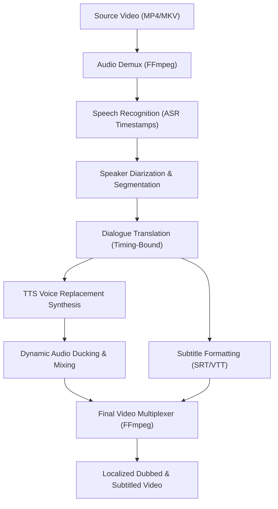

[🇸🇦 العربية](README.ar.md) | [🇬🇧 English](README.md)

# 🎥 eidcloud-video-pipeline

> **Topics:** `eidcloud` `video-pipeline` `video-translation` `automated-dubbing` `audio-ducking` `ffmpeg` `php8`

[](https://github.com/shadialhasan/eidcloud-video-pipeline/releases/tag/v1.0.0)
[](https://github.com/shadialhasan/eidcloud-video-pipeline/actions)
[](https://php.net)
[](LICENSE)
[](https://colab.research.google.com/github/shadialhasan/eidcloud-video-pipeline/blob/main/notebooks/quickstart.ipynb)

Modular video translation, AI dubbing, and subtitle orchestration pipeline. Automates extracting high-fidelity audio, timestamped speech recognition (ASR), speaker diarization, timing-constrained translation, TTS synthesis, dynamic audio ducking, and multiplexed subtitle burning using FFmpeg and modern pure PHP 8.2+.

---

## 🏛️ Architecture & Processing Pipeline



---

## 🚀 Capabilities

- **Modular Pipeline Stages:** Extensible stage interface (`StageInterface`) with isolated context passing.
- **Audio Extraction:** High-fidelity 16kHz mono/stereo WAV extraction via native FFmpeg runners.
- **Dynamic Audio Ducking:** Automatically suppresses background audio track volume (e.g. -12dB) during active dubbed speech.
- **Subtitles & Dubbing Synchronization:** Aligns synthetic voice duration to original speaker intervals and burns or embeds subtitles.
- **Zero-Dependency Core:** Orchestration layer written in pure PHP 8.2+ without external composer bloat.

---

## ⚙️ Installation & CLI Usage

```bash
git clone https://github.com/shadialhasan/eidcloud-video-pipeline.git
cd eidcloud-video-pipeline
```

### Run Video Translation Pipeline
```bash
# Full translation and dubbing pipeline
php bin/eidcloud-video translate input.mp4 --from=en --to=ar --voice=male

# Extract raw audio track
php bin/eidcloud-video extract-audio input.mp4 --out=audio.wav

# Mix dubbed voiceover with -12dB background ducking
php bin/eidcloud-video mix video.mp4 dubbed.wav --ducking=-12dB
```

---

## 🧪 Running Automated Tests

```bash
php tests/run_tests.php
```

---

## 👤 Author & Maintainer

**Eng. MHD. Shadi AL-Hasan**  
- **Role:** Executive CTO & Enterprise Solutions Architect  
- **Email:** [mhd.shadi.alhasan@gmail.com](mailto:mhd.shadi.alhasan@gmail.com)  
- **Phone / WhatsApp:** [+963934005922](tel:+963934005922)  
- **Location:** Damascus, Syria  
- **GitHub:** [shadialhasan](https://github.com/shadialhasan)  

---

## 📄 License

This project is licensed under the MIT License - see the [LICENSE](LICENSE) file for details.  
Copyright (c) 2026 **MHD. Shadi AL-Hasan**. All rights reserved.
